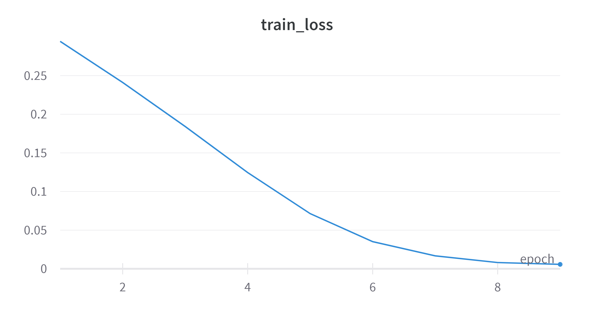
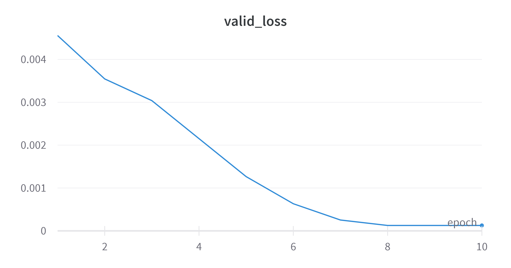

# GNN Code
Usage 


## Run Locally

Clone the project

```bash
  git clone
```

```bash
  python train.py
```


## Visual Logs
Visualise the logs at 
https://wandb.ai/vrinda19/gnn/runs/11cqcpi6/overview?workspace=user-vrinda19


## Screenshots





We observe that unlike an MLP the test loss before and after permute is nearly the same

```bash
  Test Loss before Permute : 6.768334816935604e-05
```


```bash
  Test Loss after Permute : 6.768332531481432e-05
```
